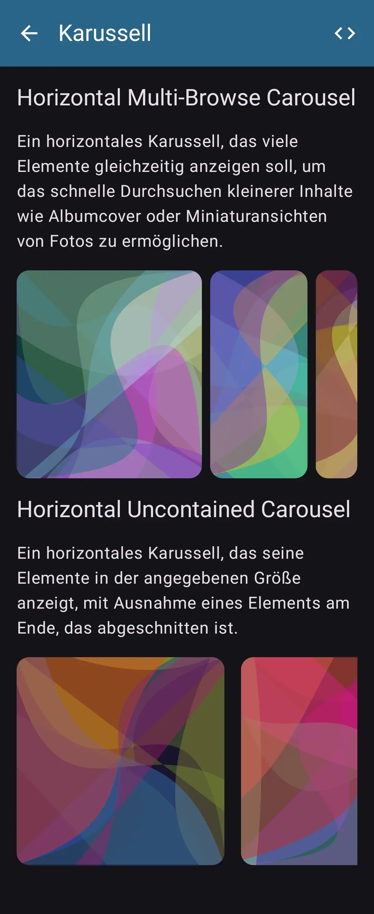

# [KMP Playground](https://payamgerackoohi.github.io/KmpPlayground/)

A sample Kotlin Multiplatform project to demonstrate different app features, targeted on Android, iOS and Desktop.

## [Screens](http://localhost:63342/KmpPlayground/docs/screenshots/screenshots.html)

### Home
<!--suppress CheckImageSize -->


### Compose
- [x] Components
  - [x] Carousel
  - [x] Dialog
  - [x] Date/Time Picker
  - [x] Pull to Refresh
- [x] Animations
  - [x] animate*As
  - [x] Animated Content
  - [x] Animated Visibility
  - [x] Crossfade

<div>
  
  
</div>

### Graphics
- [x] Color Scheme
- [x] Icons
- [ ] Charts
- [ ] OpenGL


### I/O
- [ ] Datastore
  - [x] Key-Value
  - [ ] Protobuf
- [ ] Database
  - [ ] Room
  - [ ] SqlDelight
- [ ] API
  - [x] REST (Ktor)
  - [ ] GraphQL
  - [ ] GRPC
- [ ] File

<div>
  
  
</div>


### Miscellaneous
- [x] Date/Time
- [x] C++
- [ ] BLE
- [ ] PDF


### Modules
- [x] Clock
- [x] Editor
- [x] Math Factors
- [x] Random Image


## Languages
- [English](docs/resources/values/strings.xml)
- [German](docs/resources/values-de/strings.xml)
- [Hebrew](docs/resources/values-iw/strings.xml)

## Themes
- Light
- Dark

## Code Quality and Automation
- [x] [Unit Tests](docs/reports/test/unit/index.html)
- [x] [UI Tests](docs/reports/test/ui/index.html)
- [x] [Coverage (Kover)](docs/reports/test/kover/index.html)
- [ ] CI/CD

## Build
### Android
Android Studio :: Build | Build App Bundle(s) / APK(s) | Build APK(s)

### MacOS
Install Java Coretto 17
#### Application Image (.app)
```sh
gradle createDistributable
gradle createReleaseDistributable
```
#### Installer Package (.dmg)
```sh
gradle packageDmg
gradle packageReleaseDmg
```

### C++
#### Android
The C++ code compiles during the gradle build process using `android.externalNativeBuild` tool.

#### MacOS
```shell
./scripts/cmake-build-macos.sh
```

#### iOS
- The `cpp` source code is added as a group inside xcode.
- `ios-bridge.h` is added in iosApp.xcodeproj | Build Settings | Swift Compiler - General | Objective-C Bridging Header 
- cpp sources are added in Build Phases | Compile Sources
- `libBridge.def` is configured in gradle to build kotlin interfaces out of c headers using cinterop tool 

#### Info
- jpackage
- [jlink](https://openjdk.org/jeps/282)
```kotlin
compose.desktop {
  application {
    nativeDistributions {
      // In order to include runtime dependencies to the final package file
      modules("java.sql")
      // gradle suggestModules
      // peek inside createDistributable app runtime legal folder (macOS)
      // Terrible Alternative: includeAllModules = true (no minification, even bigger than debug app!)
      macOS {
        signing {
          sign.set(true)
          identity.set("John Doe")
          // keychain.set("/path/to/keychain") 
        }
      }
    }
  }
}
// inaccurate: suggestModules?
```
- [MacOS Signing](https://github.com/JetBrains/compose-multiplatform/blob/master/tutorials/Signing_and_notarization_on_macOS/README.md)
- [conveyor](https://www.hydraulic.software/)
